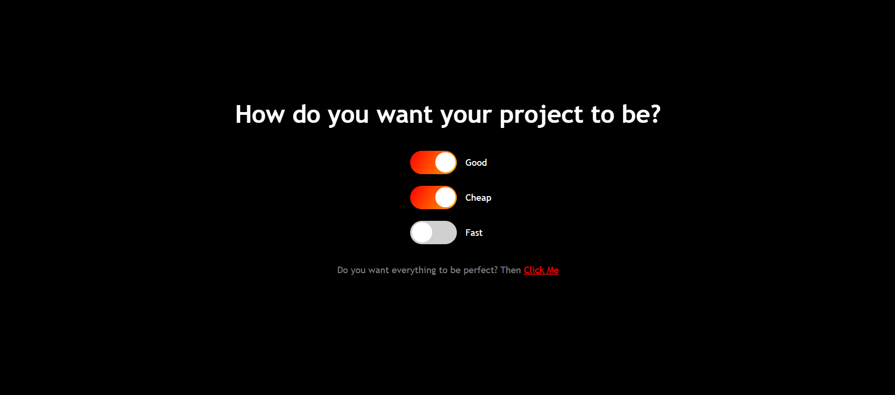

# ToggleSwitch
An interactive toggle button interface built using HTML, CSS, and JavaScript that enforces a logic constraint: only two out of three options (`Good`, `Cheap`, `Fast`) can be selected at the same time. The design automatically manages selections to ensure logical consistency.

---

## Features 🌟  

- **Three Toggle Switches:** Choose between `Good`, `Cheap`, and `Fast`.  
- **Logical Constraint:** Automatically deselects one option when all three toggles are activated.  
- **Profile Popup Modal:** Displays a user profile with a **LinkedIn connection button**.  
- **Responsive Design:** Optimized for various screen sizes with smooth animations.  

---

## Preview 👀  

  

---

## How to Use 📋  

1. Clone the repository:  
   ```bash
   git clone https://github.com/Tamilselvan6/ToggleSwitch.git
   ```
2. Navigate to the project directory:
   ```bash
   cd toggle-switch-popup
   ```
3. Open `index.html` in your browser to run the app.

---

## Technologies Used 🛠️
- HTML: For structuring the interface.
- CSS: For styling the toggle switches, animations, and the modal.
- JavaScript: For implementing toggle logic and popup modal functionality.

@Future Enhancements ✨
- Add more interactive themes for the toggle switches.
- Customize the profile modal with dynamic user input.
- Provide additional popup content or external links.

---

## License 📜
This project is open-source and available under the MIT License. Feel free to use, modify, and contribute! 😊
